# PyPinYin

利用了 Julia 的 PyCall 库，对 Python 版汉字转拼音库 `pypinyin` 进行了 Julia 封装


## 安装方法

### Step [1]
先用 pip 装好 `pypinyin` 包，并确保其在相应版本的 Python 下可用（例如：/usr/bin/python3.8）

### Step [2]
再安装稳定版本的 PyPinYin
```Julia
pkg> add PyPinYin
```
或者安装最新版本的 PyPinYin
```Julia
pkg> add https://github.com/sonosole/PyPinYin.git
```

### Step [3]
紧接着在 Julia 中安装 `PyCall` 包。为了避免 `PyCall` 自己安装的 Python 版本 (例如 python3.9) 与操作系统自带的 Python 版本 (例如 python3.8) 相冲突，需要将 Python 环境变量设置成可以正常使用 `pypinyin` 的那个 Python 版本的路径：
```Julia
julia> ENV["PYTHON"] = "/usr/bin/python3.8";  # 假设这是可以正常使用 pypinyin 的那个 Python 版本的路径
```

然后重新编译
```Julia
(@v1.6) pkg> build PyCall
    Building Conda ─→ `~/.julia/scratchspaces/44cfe95a-1eb2-52ea-b672-e2afdf69b78f/299304989a5e6473d985212c28928899c74e9421/build.log`
    Building PyCall → `~/.julia/scratchspaces/44cfe95a-1eb2-52ea-b672-e2afdf69b78f/4ba3651d33ef76e24fef6a598b63ffd1c5e1cd17/build.log`
Precompiling project...
  ✓ PyCall
  ✓ PyPinYin
  2 dependencies successfully precompiled in 13 seconds (5 already precompiled)
  2 dependencies precompiled but different versions are currently loaded. Restart julia to access the new versions
```

编译完重启 Julia，效果如下：
```Julia
(@v1.6) pkg> st
      Status `~/.julia/environments/v1.6/Project.toml`
  [438e738f] PyCall v1.92.5
  [8c847028] PyPinYin v0.1.0 `https://github.com/sonosole/PyPinYin.git#master`

julia> using PyPinYin

julia> hanzi2pinyin("你好Julia")
3-element Vector{String}:
 "ní"
 "hǎo"
 "Julia"
```

> 在 Ubuntu 21.04 + Python3.9.5 (pypinyin v0.44.0) + Julia1.6.3 (PyCall v1.92.5)下测试可用

## 主函数

`lazypinyin` 对应 `pypinyin` 中的 `lazy_pinyin`, `pinyin` 对应 `pypinyin` 中的 `pinyin`, 两个函数的参数默认值与 Python 库中的参数默认值一致，具体如下：

```Julia
lazypinyin(hanzi::String;            # 汉字串
           style::Int=NORMAL,        # 声调风格
           errors::String="default", # 如何处理没有拼音的字符(default/ignore/replace)
           strict::Bool=true,        # 是否严格遵照《汉语拼音方案》处理声母和韵母
           v2u::Bool=false,          # 是否用 `ü` 代替 `v`
           tone5::Bool=false,        # 是否用 5 标识轻声
           sandhi::Bool=false)       # 是否变调，nǐ hǎo -> ní hǎo

pinyin(hanzi::String;           # 汉字串
       style::Int=TONE,         # 声调风格
       heteronym::Bool=false,   # 多音字
       errors::String="default" # 如何处理没有拼音的字符(default/ignore/replace)
       strict::Bool=true,       # 是否严格遵照《汉语拼音方案》处理声母和韵母
       v2u::Bool=false,         # 是否用 `ü` 代替 `v`
       tone5::Bool=false)       # 是否用 5 标识轻声
```
两个函数的关键字参数名称与 `pypinyin` 中的略有不同，其中：
+ `v_to_u` 变为 `v2u`
+ `neutral_tone_with_five` 变为 `tone5`
+ `tone_sandhi` 变为 `sandhi`

此外，为了方面记忆与使用，将三种常见拼音模式设计成三个很容易记住的名字：
```
TONE12345 = TONE3  # ni2 hao3 风格，用 12345 标记五种声调, 5为轻声
TONEONTOP = TONE   # ní hǎo   风格, 在韵母上标记声调，即 tone on top of vowel 的缩写
TONELESS  = NORMAL # ni hao   风格, 无声调，即 toneless
```


## 使用示例

### lazypinyin 示例

```Julia
julia> printpinyin(lazypinyin("你好Julia"))    # 默认TONELESS, 即无声调模式
ni hao Julia

julia> printpinyin(lazypinyin("你好Julia", style=TONELESS, errors="ignore"))
ni hao

julia> printpinyin(lazypinyin("你好Julia", errors="default"))  # 默认原样保留不可转字符
ni hao Julia

julia> printpinyin(lazypinyin("好啊", style=TONE12345, tone5=true))
hao3 a5

julia> printpinyin(lazypinyin("好啊", style=TONE12345, tone5=false))
hao3 a

julia> printpinyin(lazypinyin("你好", style=TONE12345, sandhi=false))
ni3 hao3

julia> printpinyin(lazypinyin("你好", style=TONE12345, sandhi=true))  # 两个三声时，则第一个变为二声
ni2 hao3

julia> printpinyin(lazypinyin("战略", style=TONEONTOP, v2u=true))  # 只要是 TONEONTOP 格式，则都用 ü 代替 ve
zhàn lüè

julia> printpinyin(lazypinyin("战略", style=TONEONTOP, v2u=false)) # 只要是 TONEONTOP 格式，则都用 ü 代替 ve
zhàn lüè

julia> printpinyin(lazypinyin("战略", style=TONE12345, v2u=false))  # 非 TONEONTOP 格式，v2u选项可以控制 ü 是否代替 ve
zhan4 lve4

julia> printpinyin(lazypinyin("战略", style=TONELESS, v2u=true)) # 非 TONEONTOP 格式，v2u选项可以控制 ü 是否代替 ve
zhan lüe
```

### pinyin 示例

此函数没有变调选项 `sandhi`

```Julia
julia> printpinyin(pinyin("你好啊Julia", style=TONEONTOP, errors="ignore", heteronym=true))
["nǐ"] ["hǎo"] ["a", "ā", "á", "ǎ", "à", "è"]
```

### hanzi2pinyin (很常用的拼音习惯)

```Julia
julia> printpinyin(lazypinyin("你好啊Julia，战略！", style=TONEONTOP, v2u=true, sandhi=true))
ní hǎo a Julia， zhàn lüè ！

julia> hanzi2pinyin("你好啊Julia，战略！") |> printpinyin  # 与上述表述等价
ní hǎo a Julia， zhàn lüè ！
```

## 汉字转拼音大致逻辑

1. 将输入分成若干词条
2. 词条转拼音的逻辑：
   1. 词条不是汉字，处理无拼音字符
   2. 词条在词组字典中，则直接取这个词条的拼音数据
   3. 词条不在词组字典中，遍历词条的汉字，每个汉字进行单独处理
3. 单汉字转拼音逻辑：
   1. 检查汉字是否在单汉字字典中，如果在则直接取其对应拼音
   2. 如果不在，处理无拼音字符
4. 无拼音字符处理逻辑: 根据错误类型返回不同的结果
5. 对上面的步骤获得的拼音数据按指定的拼音风格进行转换

* 词组字典：词组与其对应的拼音字典(中国->zhong guo; 语音->yu yin; ...)
* 单汉字字典: 单个汉字的拼音数据(中->zhong; 国->guo; ...)

**逻辑流程图**：



## 致谢
感谢 [pypinyin](https://github.com/mozillazg/python-pinyin) 的作者们 :)
