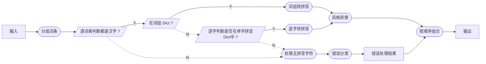

```mermaid
graph LR
  输入[输入]

  分词([分成词条])

  逐词条判断都是汉字[/逐词条判断都是汉字 ?/]

  在词组字典中[/在词组 Dict ?/]

  词组转拼音([词组转拼音])

  处理无拼音字符([处理无拼音字符])

  逐字判断是否在单字拼音Dict中[/逐字判断是否在单字拼音Dict中 ? /]

  风格转换([风格转换])

  按顺序组合([按顺序组合])

  输出[输出]

  逐字转拼音([逐字转拼音])

  错误分类([错误分类])

  错误处理结果[错误处理结果]


  输入 --> 分词

  分词 --> 逐词条判断都是汉字

  逐词条判断都是汉字 --Y--> 在词组字典中

  逐词条判断都是汉字 -.N.-> 处理无拼音字符

  在词组字典中 --Y--> 词组转拼音

  在词组字典中 -.N.-> 逐字判断是否在单字拼音Dict中

  词组转拼音 --> 风格转换

  风格转换 --> 按顺序组合

  按顺序组合 --> 输出

  逐字判断是否在单字拼音Dict中 --Y--> 逐字转拼音

  逐字判断是否在单字拼音Dict中 -.N.-> 处理无拼音字符

  逐字转拼音 --> 风格转换

  处理无拼音字符 --> 错误分类

  错误分类 --> 错误处理结果

  错误处理结果 --> 按顺序组合

```

可以通过 [在线渲染工具查看](https://mermaid-js.github.io/mermaid-live-editor/)
